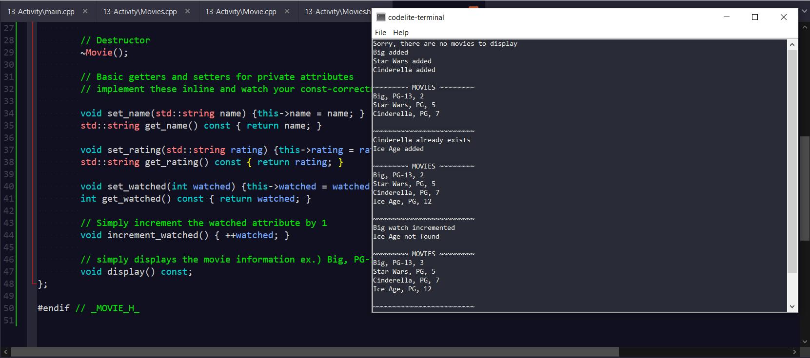

  

# Movie Listings
a simple app that adds movies to a list and prints out their title, rating, and how many time's you've viewed them. (Change code to add movies/change views. No Command Line Interface)

### Instructions
For this challenge you are to develop the foundation for a program 
for movie fanatics to keep track of what movies they have watched
and how many times they watched each movie.

The program must support the following:

class Movie - models a movie which includes
- movie name
- movie rating (G, PG, PG-13, R)
- watched - the number of times the movie has been watched

class Movies - models a collection of movie objects

Obviously, Movies needs to know about Movie since it is a collection of Movie object
However, our main driver should only interact with the Movies class.

For example. a simple main should be able to
- create a Movies object
- ask the Movies object to add a movie by providing the movie name, rating and watched count
- ask the Movies object to increment the watched count by 1 for a movie given its name
- ask the Movies object to display all of its movies

Additionally, 
- if we try to add a movie whose name is already in the movies collection 
we should display this error to the user
- if we try to increment the watched count for a movie whose name is not in the movies
collection we should display this error to the user

I've provided a basic shell as a starting point for one possible solution 
that has fully implemented
- Movie and main

You can choose to use my starting point or start from scratch.

Here is what your project files should look like:
-Movie.h - include file with the Movie class specification
-Movie.cpp -  file with the Movie class implementation
-Movies.h - include file with the Movies class specification
-Movies.cpp -  file with the Movies class implementation
-main.cpp - the main driver that creates a Movies object and adds and increments movies

Don't create a menu-driven system like we've done in the past -- just concentrate on getting
the program working. Once it is working, you can certainly provide a menu system for the user

This program is not trivial for, but it's a good challenge for beginning C++ programmers.

Here is a sample main and the output. Make sure you understand the program flow before
you start coding!

Good luck and have fun!